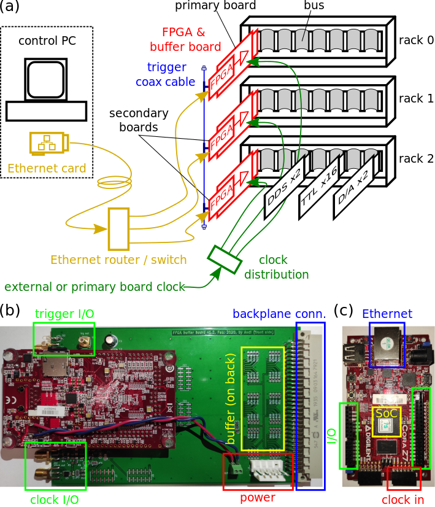

# FPGA-SoC experiment control system

## Project structure

The project has several folders. Look at the readme.md files for specific instructions.

```
├── firmware-release                firmware to be saved on the SD card
├── FPGA-buffer-card                schematics and production files of buffer card 
│   ├── v1.2
│   │   └── production
│   │       └── gerber
│   ├── v1.3
│   │   └── production
│   │       ├── gerber
│   │       └── gerber_drill_X2
│   └── v1.4
├── FPGA-firmware                   firmware source
│   ├── Petalinux_2017.4
│   └── Vivado_2017.4
├── labscript-suite
│   └── userlib
│       ├── labscriptlib
│       │   └── FPGA_test
│       └── user_devices
├── paper
│   ├── data
│   └── schematics
└── Windows-DLL
    ├── images
    ├── source
    │   ├── dio24
    │   └── dio64_32
    │       ├── dio64_32
    │       └── Dlltest
    ├── Windows-DLL-x64
    └── Windows-DLL-x86
```


| folder                         | description                          | toolchain            | language            |
|--------------------------------|--------------------------------------|----------------------|---------------------|
| firmware-release               | firmware to be saved on SD card      | -                    | - 
| FPGA-firmware/Vivado_2017.4    | hardware (logic) implementation      | Xilinx Vivado 2017.4 | Verilog             |
| FPGA-firmware/Petalinux_2017.4 | software (driver, server)            | petalinux 2017.4     | C/C++, shell script |
| FPGA-buffer-card               | electronic schematics of buffer card | KiCad 5.1            | -                   |
| labscript-suite                | labscript device                     | labscript-suite      | Python 3            |
| Windows-DLL                    | Windows dynamic link library         | Visual Studio 2019   | C++                 |
| paper                          | publication about FPGA-Soc           | -                    | -                   |
| paper/data                     | data and analysis used in paper      | -                    | Python 3            |
| paper/schematics               | electronic scheme used for auto-sync | KiCad 5.1            | -                   |


## Project Overview

This project contains everything to run and generate your own FPGA-SoC experimental control system designed for cold or ultracold atoms experiments. But any other use is welcome!

Here a figure (taken from the paper) with an overview of the system:



(a) Each of the FPGA-SoC boards (red) is inserted inside of a 19" rack at possibly remote locations from each other and are connected via Ethernet (orange) to a control computer. The timing is provided by an external clock (green) and a trigger line (blue) which is driven by one of the boards (the primary board) and connects to all of the other (secondary) boards. (b) Image of the FPGA-SoC mounted on top of the buffer card used to connect the FPGA-SoC with the rack. (c) Image of the FPGA-SoC board.

The heart of the exerpimental control system is the Cora-Z7 board from Digilent Inc. https://digilent.com/shop/cora-z7-zynq-7000-single-core-for-arm-fpga-soc-development/. There are two versions: the Cora-Z7-10 has a dual core CPU but is out of production. The Cora-Z7-07S has a single-core CPU, is slightly cheaper and is still manufactured. The only measurable difference between the two boards is that the uploading rate of the single-core CPU board is about 80% smaller than that of the dual-core CPU. This difference is only significant for very large number of samples [see paper](/paper). Be sure to use the firmare for your board [see firmware folder](/firmware-release).

This is a low-cost FPGA-SoC development board. The SoC (system-on-a-chip) has a dual or single-core CPU (ARM Cortex A9) and on the same chip a FPGA (field-programmable gate array). The CPU allows to run a simple Linux operating system (Petalinux 2017.4) on the CPU which allows you to run your custom code or applications and facilitates using system services to access external hardware (Ethernet, DDR memory, USB keyboard/mouse, SD card, etc.). The FPGA allows to implement custom hardware (logic, PLLs, SERDES, etc.) which you can configure as you please. The tight connection between the CPU and FPGA allows to control the hardware by software and to efficiently transfer data between the two parts. 

An alternative board using an Intel/Altera FPGA-SoC could be the DE10-Nano Kit from Terasinc. It is more powerful but also more expensive than the Cora. However, I have not tested this device:
https://www.terasic.com.tw/cgi-bin/page/archive.pl?Language=English&CategoryNo=167&No=1046

The implementation of the FPGA-SoC for "experimental control" was born out of the need to replace an old DIO64 card (from Viewpoint Systems) which is not anymore supported/sold and uses old Hardware (PCI slot) and old operating systems (Windows XP/7/8). This card was preferrably programmed with NI Labview/LabwindowsCVI user application programms which create a table of time and instructions (32bit time and 32 or 64bit data) which is sent to the driver. The card performs the task of outputting the data at the programmed time (typically in units of us) on a 50-way ribbon cable of 2-3m length. This cable is connected to a 19" rack which hosts our custom hardware. After buffering and electrical isolation (in a custom buffer card) the data are available on a bus at the backplane of the rack. Several plug-in modules of different type and size can be inserted into the rack and connect to this bus. Typical devices are digital and analog outpus and DDS (direct digital synthesizers, i.e. RF generators). Some experiments might use also input devices, but not in our design. Each device has an address decoder and 7 bits of the data are reserved for the address of the device. 16 data bits are reserved for device specific data. One bit called "Strobe" is used as a pseudo-clock, which is simply a clock which pulses only when something on the bus should be updated. This signal is originally recovered from a bit generated by the software and sent with the data by the DIO64 card. This bit must change state for every instruction and in the buffer card a simple electronic cirquit generates the pulses out of this signal. The pulses must be shorter than the update rate of the bus (essentially, it has twice the frequency than the bus) and must be delayed in time with the bus update. This way delays between different bits on the bus (known as skew) and noise is cancelled.

The FPGA-SoC replaces the DIO64 card but also improves the old system in many ways:
1. the data is uploaded via Gigabit Ethernet:
  * even for long sequences the uploading time is small (2.3s for 10M samples)
  * electrical isolation given by Ethernet
  * much longer cables are possible. this even allows remote-control over network.
  * no driver is needed on the experimental control computer 
    * no restrictions on operating system
    * no restriction on used software
  * experimental control computer is free to do other things during the execution of the sequence since there is no busy driver running in the background
2. 10M samples can be stored directly on the board
  * this size (128MiB) is more than sufficient for most of our experiments
  * repetitions of the same experiment can be done directly by the board without uploading the data again
  * in a future extension, only parts of the data could be updated in memory
3. contiguous bus output rate of 30-40MHz
  * the data from the memory into the FPGA part is transmitted via direct memory access (DMA) which gives the limitation of contiguous data output rate
  * theoretical limit is 29MHz for 64bit data and 43MHz for 32bit data (350MB/s per write and read channel and 8 or 12 bytes per samples)
  * write to the bus and read from the bus can be done simultaneously without affecting the other channel
  * using more of the unused DMA ports and optimising for write/read-only access can increase the rate (factor 2x should be possible, maybe even 4x)
4. the internal FIFOs hold 8192 samples which allows short "burst" of output/input at higher rates
  * for short time and ensuring the FIFO is not getting empty/full output/input can be done at higher rates
5. the internal clock of the FPGA part is running at the moment with the default 50MHz
  * increasing to 100MHz is "easy" but most likely the FPGA design has to be slightly adapted to meet the timing constraints
  * using the "strobe" the output rate is limited to half of the FPGA clock frequency (current design even 1/3)
  * additional considerations are voltage levels (at the moment 5V) and proper termination of the bus (at the moment unterminated). 
  * to use differential lines the FPGA would support this but the given board design strongly constrains on usable pairs. Additionally, levels cannot be easily mixed (should work but it is out of specification). 
6. the FPGA-SoC allows to customize for your application. We have the freedom to implement new ideas, features, use new devices, implement protocols, etc. here a list what could be done or is partially already done or tested:
  * we tested to synchronize several boards by using a common clock signal and to trigger the boards from one board and measure and correct for the propagation delay of the trigger signal. This way we could synchronize 2 boards with about 1ns. This is not fully implemented but should become a standard feature.
  * you could run additional software on the CPU. for example some python analysis/feedback program, which changes the state of the experiment depending on measured values. note however, this cannot be "very" fast (the CPU runs at 650MHz). Very fast things could be done on the hardware, but also this is limited to 100-200MHz, but things can be done in parallel (on many bits).
  * the board features an USB port which can be configured as device (passive, like a flash drive) or host (active, like your computer). Many modern laboratory equipments allow to be remote controlled via USB (using the USBTMC protocol) or older devices use the GPIB port for which USB-to-GPIB adapters exist. You could directly control such a device from the FPGA-SoC using a simple application running on the CPU or with data which you send via Ethernet.
  * one could implement ramps directly on the board and update only parts of the sequence

> [!NOTE]
> I am in the phase of updating this page soon...


